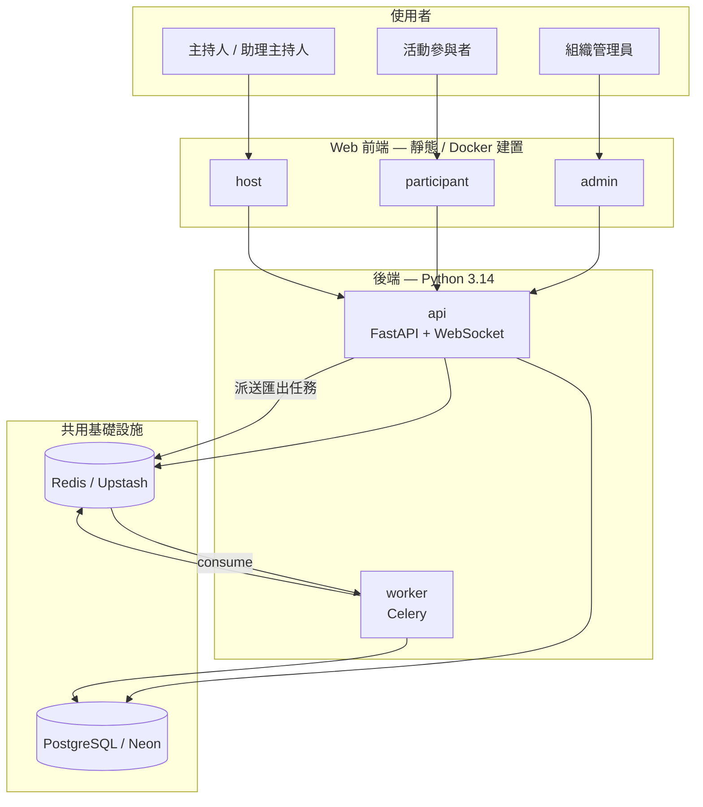

# LiveEngage — 五大服務架構

> **接手必讀**：Zeabur（或同類 PaaS）上本專案以 **monorepo** 部署為 **5 個獨立服務**。  
> 部署細節見 [Zeabur_部署指引.md](./Zeabur_部署指引.md)；現場維運見 [RUNBOOK.md](./RUNBOOK.md)。

---

## 總覽

| # | Zeabur 服務名 | 類型 | 生產 URL（範例） | Dockerfile / 目錄 |
|---|---------------|------|------------------|---------------------|
| 1 | **api** | 後端 Web | https://le-api.zeabur.app | 根目錄 [`Dockerfile`](../Dockerfile) |
| 2 | **host** | 前端 | https://le-host.zeabur.app | [`frontend/Dockerfile.host`](../frontend/Dockerfile.host) |
| 3 | **participant** | 前端 | https://le-participant.zeabur.app | [`frontend/Dockerfile.participant`](../frontend/Dockerfile.participant) |
| 4 | **admin** | 前端 | https://le-admin.zeabur.app | [`frontend/Dockerfile.admin`](../frontend/Dockerfile.admin) |
| 5 | **worker** | 後端背景 | **無公開網域** | 根目錄 [`Dockerfile.worker`](../Dockerfile.worker) |

三個前端在建置時以 `VITE_API_BASE=https://le-api.zeabur.app` 指向 **api**；**不**直接連 worker。

---

## 1. api — 即時互動主 API

**進程**：`alembic upgrade head && uvicorn app.main:app`（見根目錄 `Dockerfile`）

**負責**（所有需要**低延遲、對外 HTTP/WS** 的後端能力）：

| 能力 | 說明 |
|------|------|
| REST API | `/api/v1/*` — 登入、活動、Poll、Quiz、Q&A、Survey、Ideas、Admin、品牌、匯出任務**建立**與下載等 |
| WebSocket | 即時廣播（投票更新、Quiz 子題、Q&A…）；**寫入仍走 REST**（鐵律） |
| DB migration | 容器啟動時自動 `alembic upgrade head` |
| Redis 常駐 | Pub/Sub → WS 轉發；Q&A 計數 flush（**在 api 進程內**，非 Celery worker） |
| 健康檢查 | `GET /health`、`GET /ready` |

**程式入口**：[`backend/app/main.py`](../backend/app/main.py)  
**路由聚合**：[`backend/app/api/v1/router.py`](../backend/app/api/v1/router.py)

**環境變數（核心）**：`LE_DATABASE_URL`（async）、`LE_DATABASE_URL_SYNC`（migration）、`LE_REDIS_URL`、`LE_JWT_SECRET`、`LE_ENV`

---

## 2. host — 主持人端

**使用者**：組織 **主持人（host）**、**助理主持人（cohost）**（JWT 登入）

**負責**：

| 功能 | 說明 |
|------|------|
| 活動儀表板 | 建立／管理 Session、設為進行中、分享 QR／加入連結 |
| 現場控場 | Poll 控制台、Quiz 控制台、Q&A 審核、Sprint9（Ideas / Survey） |
| 大螢幕投影 | **同源** hash 路由 `#/rooms/{roomId}/…/present`（另開新視窗），**不再**有獨立 present 站 |
| 組織品牌 | 頂欄 Logo、favicon、主色（`OrgBrandingProvider`） |

**程式目錄**：[`frontend/apps/host`](../frontend/apps/host)

**權限 UI**：助理主持人可控場／投影／審核，但**不可**建立／編輯／刪除 Poll／Quiz 結構（後端 `host_permissions` 強制）。

---

## 3. participant — 參與者端

**使用者**：活動現場**參與者**（掃 QR 或輸入代碼，**免登入** participant token）

**負責**：

| 功能 | 說明 |
|------|------|
| 加入活動 | `/join/{code}`、顯示名稱、選 Room |
| 即時互動 | 投票作答、Quiz 作答、Q&A 提問／按讚、Ideas、Survey |
| 重連備援 | Session state 快照 + 30s 輪詢；WebSocket 斷線時仍可恢復 |

**程式目錄**：[`frontend/apps/participant`](../frontend/apps/participant)

**組織品牌**：依活動代碼載入公開品牌設定。

---

## 4. admin — 管理後台

**使用者**：組織 **管理員（admin）**、**擁有者（owner）**

**負責**：

| 功能 | 說明 |
|------|------|
| 活動管理 | 列表、封存 |
| 帳號管理 | 邀請／編輯／移除成員（姓名、密碼、角色） |
| 組織設定 | 名稱、品牌（Logo、主色） |
| 資料匯出 | 建立 CSV/XLSX 匯出任務（**執行**由 worker 完成） |
| 稽核紀錄 | 操作 log 查詢 |

**程式目錄**：[`frontend/apps/admin`](../frontend/apps/admin)

**API 前綴**：`/api/v1/admin/*`（需 `role >= admin`）

---

## 5. worker — Celery 背景 Worker

**進程**：`celery -A app.workers.celery_app worker …`（見 [`Dockerfile.worker`](../Dockerfile.worker)）

**負責**（**耗時、可非同步**、**不對外**的任務）：

| 任務 | 說明 |
|------|------|
| `export.run_job` | Admin 建立的活動資料匯出：查 DB → 產 CSV/XLSX → 寫 storage → 更新 `ExportJob` 狀態 |

**流程**：

1. Admin → **api**：`POST /api/v1/admin/exports`（job 狀態 `pending`）
2. **api** → Redis（Celery broker）：`enqueue_export_job`
3. **worker** 消費任務 → 寫入 DB / 檔案
4. Admin → **api**：`GET /api/v1/admin/exports` 查狀態與簽名下載連結

**若未部署 worker**：匯出會一直停在 **pending**（見 RUNBOOK §3.4）。  
**暫時替代**（僅小流量）：api 設 `LE_CELERY_TASK_ALWAYS_EAGER=true`，在 api 進程同步跑匯出（生產不建議）。

**環境變數**：與 api 相同核心項 + 建議 `LE_CELERY_TASK_ALWAYS_EAGER=false`

**規劃中、尚未實作**：analytics、retention、notification 等 Celery 任務（見實作指引 `workers/` 目錄說明）。

---

## api 與 worker 如何分工

| | **api** | **worker** |
|---|---------|------------|
| 對外 | 有（HTTPS + WSS） | 無 |
| 延遲要求 | 低（現場控場） | 可高（匯出數十秒） |
| 共用程式碼 | `backend/app/` | 同左 |
| 入口 | `uvicorn app.main:app` | `celery … celery_app` |
| Redis 用途 | Pub/Sub、快取、Idempotency、Celery **派送** | Celery **消費** |

> **注意**：api 進程內另有 **Q&A flush worker**（`qa_redis.start_flush_worker`），名稱含 worker 但是 **api 內建背景協程**，與 Zeabur 上的 **worker 服務（Celery）** 不同。

---

## 本地開發對照

| 服務 | 本地怎麼跑 |
|------|------------|
| api | `cd backend && uvicorn app.main:app --reload` |
| host | `cd frontend/apps/host && npm run dev` |
| participant | `cd frontend/apps/participant && npm run dev` |
| admin | `cd frontend/apps/admin && npm run dev` |
| worker | `cd backend && celery -A app.workers.celery_app worker -l info`（需 Redis） |

前端 dev 時需設定 `VITE_API_BASE` 指向本地 api（通常 `http://localhost:8000`）。

---

## 相關文件

| 文件 | 用途 |
|------|------|
| [Zeabur_部署指引.md](./Zeabur_部署指引.md) | 各服務 Dockerfile、env、網域 |
| [RUNBOOK.md](./RUNBOOK.md) | 現場流程、故障排除 |
| [LiveEngage_AI_Coding_Agent_實作指引.md](./LiveEngage_AI_Coding_Agent_實作指引.md) | 鐵律、目錄結構、Sprint |
| [../DEVNOTE.md](../DEVNOTE.md) | 近期變更與部署快照 |
